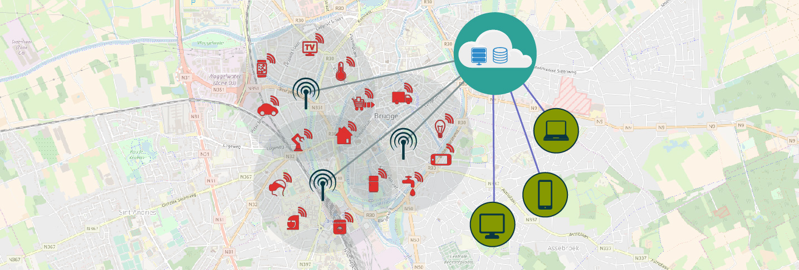
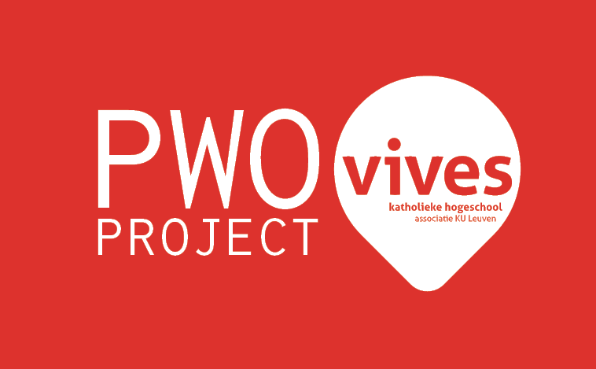

# LoRaWAN: from Node to Application

LoRaWAN is a Long Range and Low Power   technology, enabling transmission of data over multiple kilometers with a battery life of a couple of years.

---

<ContentOverview></ContentOverview>

--- 

### Project sponsors:

allora Factory - Ardovlam - DPTechnics - E20 - Infrax - LPWAN Solutions - Ninix-tech - Provincie West-Vlaanderen - QBMT - Sharecom - UCLL - VIVES - KU Leuven - Howest

--- 

<footer style="text-align: center;">
  
</footer>