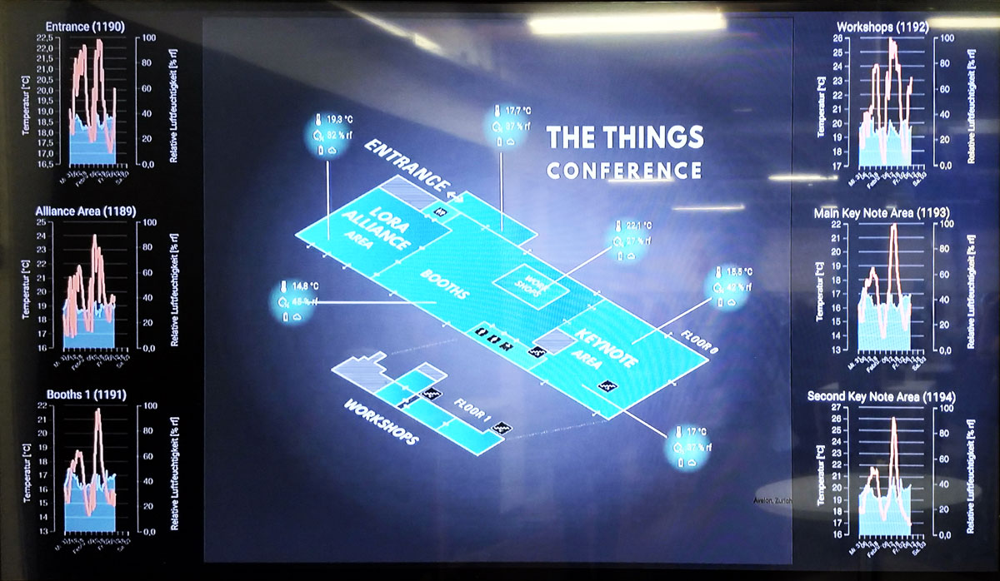
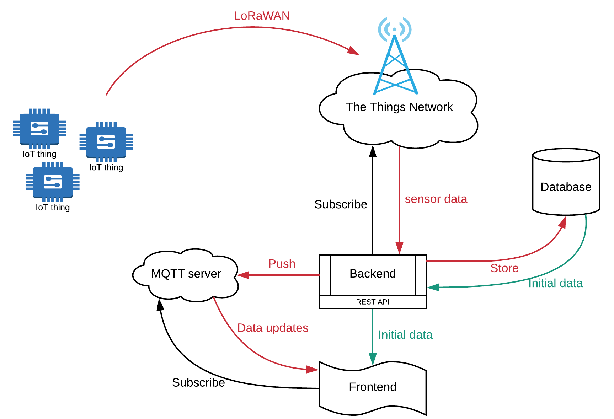
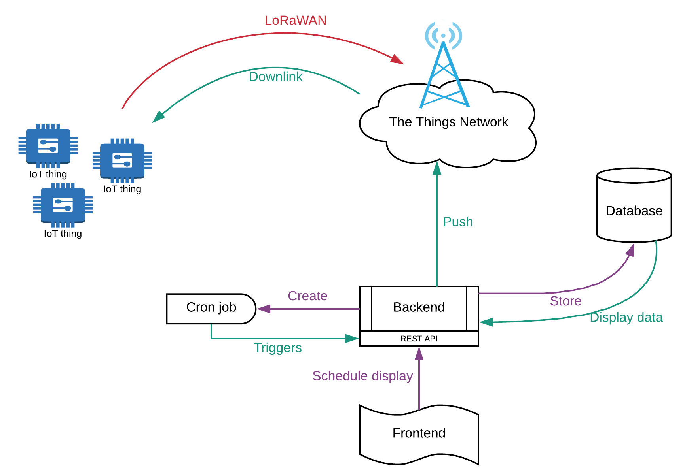

# Projectwork 2 - A Smart Campus

In the second year of the Electronics and ICT education the students need to realize a project as a group. This years assignment was to develop the basis for a smart campus.

These days IoT devices communicate over huge distances, while needing to be low power so the battery can lasts months or even years. This brings some serious challenges to the board.

LoRaWAN is an ideal technology that enables to build IoT solutions using Ultra Low Power sensors that can communicate over kilometers of distance. LoRaWAN enables to place multiple sensors to existing or new buildings like our campus, to measure and control various parameters. The ultra low power requirements make it possible to do this with small battery powered systems. No need to add new cables or use large and bulky batteries. No need to recharge the batteries on a daily, weakly or yearly basis. LoRaWAN should be able to last up to 5 or even 10 years using a couple of AA batteries.

To make things smarter you need a couple of basic components such as:

* sensors that capture data;
* a communication channel to a backend that stores and processes the data;
* a web application to visualize the data;
* logic that can act upon the gathered data.

In this project the focus were the first three components as we do not have the necessary access to the controls of the building to implement the last.

## The hardware

The students were in charge of developing a sensorboard that could monitor flex desk occupation (motion) and room quality (temperature, humidity and light).

A second hardware platform needed to be realized that was equipped with a low-power Epaper display. Epaper displays only use a small amount of power when changing the pixels. When done, the display can be powered off completely and it will keep displaying the content on the screen. This can then be used to display the schedule of the LAB or classroom for the current day.

Both these boards needed to be efficient, wireless and battery powered.

## The Dashboard

All the hardware systems would be useless if the data they produced disappeared in thin air. A monitoring system must be provided. All data and parameters should be stored in a database, and a graphical user interface should be able to visualize the data in different and useful ways, like charts and graphs.

An example was given to the students that we encountered at the Things Conference, displaying a floorplan and some sensoring values.

## Management

On the other hand the devices and smart signs should be able to be managed. Adding, or changing schedules for classrooms could easily be done with this system. Updating the signs with new information should be done on an automatically timed process, preventing the need of human intervention.

## Architecture

To get data from sensor to user, the following architecture can be used as a base.

Next to that the system should also allow the displays to be updated via the downlink.

## More Information

More information and the report of the students can be found at [projectwerk.gitbook.io](https://projectwerk.gitbook.io).