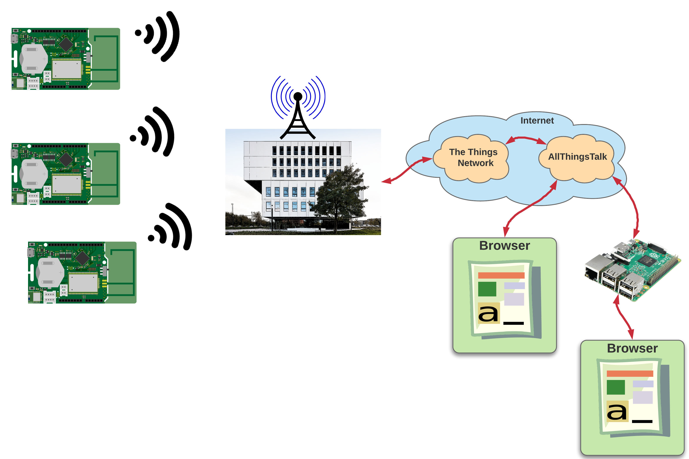
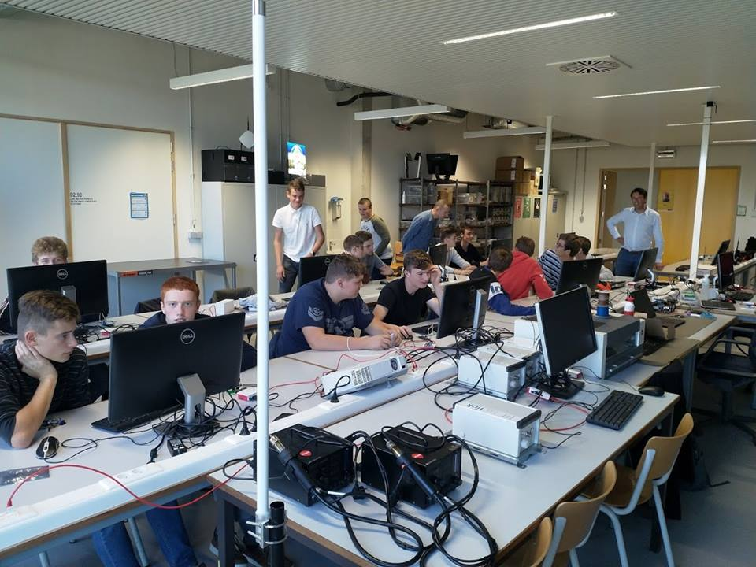

# Workshop VTI Torhout

At least once a year a session concerning embedded devices is organized for high-school students. This time the topic was LoRaWAN and sensoring devices.

The workshop gave an introduction into wireless communication using LoRaWAN. The Sodaq ExpLoRer - an Arduino compatible development board - was used to connect all kinds of Grove sensors. Ranging from temperature sensors to capacitive touch sensors.

The workshop build up to the final goal of realizing a dashboard that displayed the sensor value of the student. A gradual approach was used using the following steps:

* Setup the Arduino IDE for SODAQ ExpLoRer
* Read out a Grove sensor (student were free to choose)
* Transmitting the sensor values via LoRaWAN
* Setting up an application at the Things Network
* Capturing the data using Node-RED and making it available through a local MQTT broker
* Building a custom dashboard
* Setting up a Webserver on the Raspberry Pi

The workshop was attended by 15 students and 2 teachers of VTI Torhout.

All information can be found at [lorawan-workshop.99bugs.be](https://lorawan-workshop.99bugs.be/).